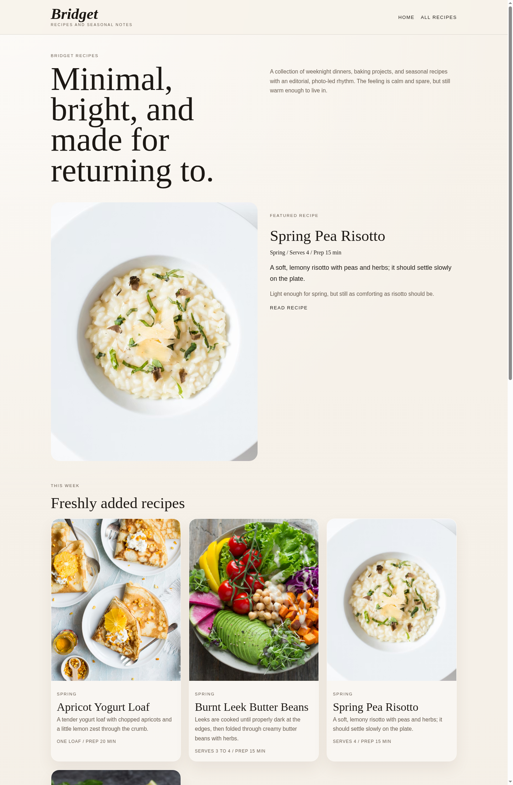
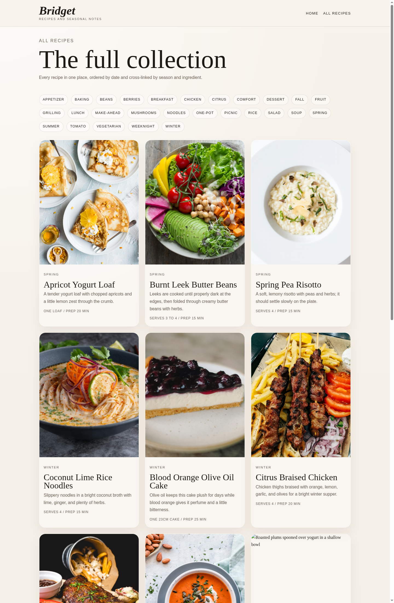
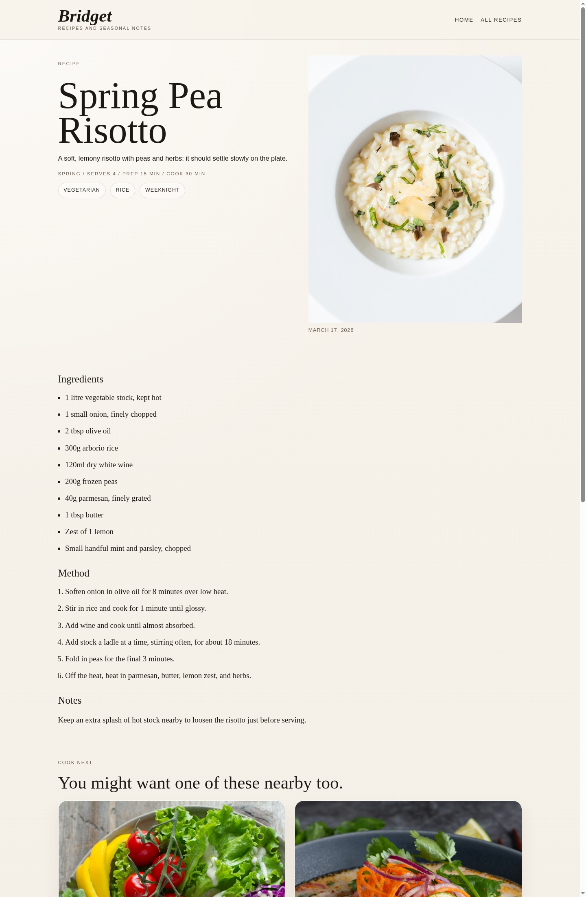

# Recipe Site Redesign QA

*2026-04-21T03:07:51Z by Showboat 0.6.1*
<!-- showboat-id: 0e1527f1-ca5f-474c-9f40-afd7feecdbe4 -->

Editorial styling pass for the Astro recipe site, plus richer sample recipe data and taxonomy pages. Screenshots were captured with Rodney against Astro preview on http://127.0.0.1:4321/.

```bash
cd /workspace && ASTRO_TELEMETRY_DISABLED=1 npm run build
```

```output

> build
> astro build

03:07:52 [content] Syncing content
03:07:52 [content] Synced content
03:07:52 [types] Generated 71ms
03:07:52 [build] output: "static"
03:07:52 [build] mode: "static"
03:07:52 [build] directory: /workspace/dist/
03:07:52 [build] Collecting build info...
03:07:52 [build] ✓ Completed in 101ms.
03:07:52 [build] Building static entrypoints...
03:07:53 [vite] ✓ built in 1.05s
03:07:53 [build] ✓ Completed in 1.10s.

 generating static routes 
03:07:53 ▶ src/pages/all-recipes.astro
03:07:53   └─ /all-recipes/index.html (+13ms) 
03:07:53 ▶ src/pages/recipes/apricot-yogurt-loaf.md
03:07:53   └─ /recipes/apricot-yogurt-loaf/index.html (+3ms) 
03:07:53 ▶ src/pages/recipes/blood-orange-cake.md
03:07:53   └─ /recipes/blood-orange-cake/index.html (+2ms) 
03:07:53 ▶ src/pages/recipes/burnt-leek-butter-beans.md
03:07:53   └─ /recipes/burnt-leek-butter-beans/index.html (+3ms) 
03:07:53 ▶ src/pages/recipes/charred-corn-salad.md
03:07:53   └─ /recipes/charred-corn-salad/index.html (+3ms) 
03:07:53 ▶ src/pages/recipes/citrus-braised-chicken.md
03:07:53   └─ /recipes/citrus-braised-chicken/index.html (+2ms) 
03:07:53 ▶ src/pages/recipes/coconut-lime-rice-noodles.md
03:07:53   └─ /recipes/coconut-lime-rice-noodles/index.html (+2ms) 
03:07:53 ▶ src/pages/recipes/mushroom-toasts.md
03:07:53   └─ /recipes/mushroom-toasts/index.html (+1ms) 
03:07:53 ▶ src/pages/recipes/roasted-plum-ripple.md
03:07:53   └─ /recipes/roasted-plum-ripple/index.html (+3ms) 
03:07:53 ▶ src/pages/recipes/soft-herb-frittata.md
03:07:53   └─ /recipes/soft-herb-frittata/index.html (+2ms) 
03:07:53 ▶ src/pages/recipes/spring-pea-risotto.md
03:07:53   └─ /recipes/spring-pea-risotto/index.html (+2ms) 
03:07:53 ▶ src/pages/recipes/squash-soup.md
03:07:53   └─ /recipes/squash-soup/index.html (+1ms) 
03:07:53 ▶ src/pages/recipes/strawberry-shortcake.md
03:07:53   └─ /recipes/strawberry-shortcake/index.html (+1ms) 
03:07:53 ▶ src/pages/recipes/tomato-galette.md
03:07:53   └─ /recipes/tomato-galette/index.html (+1ms) 
03:07:53 ▶ src/pages/tags/[tag].astro
03:07:53   ├─ /tags/appetizer/index.html (+2ms) 
03:07:53   ├─ /tags/baking/index.html (+1ms) 
03:07:53   ├─ /tags/beans/index.html (+1ms) 
03:07:53   ├─ /tags/berries/index.html (+1ms) 
03:07:53   ├─ /tags/breakfast/index.html (+1ms) 
03:07:53   ├─ /tags/chicken/index.html (+1ms) 
03:07:53   ├─ /tags/citrus/index.html (+1ms) 
03:07:53   ├─ /tags/comfort/index.html (+2ms) 
03:07:53   ├─ /tags/dessert/index.html (+1ms) 
03:07:53   ├─ /tags/fall/index.html (+1ms) 
03:07:53   ├─ /tags/fruit/index.html (+1ms) 
03:07:53   ├─ /tags/grilling/index.html (+1ms) 
03:07:53   ├─ /tags/lunch/index.html (+1ms) 
03:07:53   ├─ /tags/make-ahead/index.html (+1ms) 
03:07:53   ├─ /tags/mushrooms/index.html (+1ms) 
03:07:53   ├─ /tags/noodles/index.html (+1ms) 
03:07:53   ├─ /tags/one-pot/index.html (+1ms) 
03:07:53   ├─ /tags/picnic/index.html (+2ms) 
03:07:53   ├─ /tags/rice/index.html (+1ms) 
03:07:53   ├─ /tags/salad/index.html (+1ms) 
03:07:53   ├─ /tags/soup/index.html (+1ms) 
03:07:53   ├─ /tags/spring/index.html (+1ms) 
03:07:53   ├─ /tags/summer/index.html (+1ms) 
03:07:53   ├─ /tags/tomato/index.html (+1ms) 
03:07:53   ├─ /tags/vegetarian/index.html (+1ms) 
03:07:53   ├─ /tags/weeknight/index.html (+1ms) 
03:07:53   └─ /tags/winter/index.html (+1ms) 
03:07:53 ▶ src/pages/index.astro
03:07:53   └─ /index.html (+1ms) 
03:07:53 ✓ Completed in 90ms.

03:07:53 [build] 42 page(s) built in 1.31s
03:07:53 [build] Complete!
```

Homepage, collection, and recipe detail screenshots from Rodney:

```bash {image}

```



```bash {image}

```



```bash {image}

```


